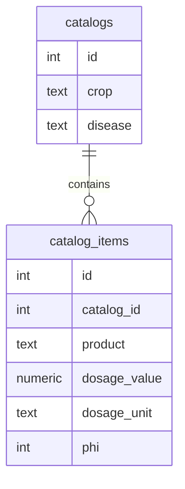

Data Contract – «Карманный агроном» (Bot‑Phase)

Version 1.17 — 21 November 2025(v1.16 → v1.17: variety в диагнозе, привязка recent_diagnosis к объекту)

0 · Scope

Документ фиксирует схему БД, правила хранения, линии происхождения данных и JSON‑контракты API для MVP Telegram‑бота.

Мастер диагностики собирает медиагруппу 3–8 фото с подсказками «Как сфоткать» (общий вид, лист лицевая, лист изнанка, плод/цветок/корень опционально). Анализ запускается после базового минимума: общий + лицевая + изнанка листа; остальное предлагается дослать или пропустить. Подборка чистится по таймауту 30 мин.

Объекты хранят координаты в meta.lat/meta.lon (числа, диапазон lat −90..90, lon −180..180); частичные апдейты не затирают существующий meta. Координаты можно обновить через /location, geo-point или адрес (геокодер + кеш).

При автодетекте локации бот показывает карточку «Нашли участок возле…?» с кнопкой карты (OSM) и подтверждением/изменением. Автопросы не спамят: TTL 12 ч на подтверждение, повторный запрос не чаще 30 мин. Геокодер кешируется в Redis, ограничивается per-user rate‑limit и логирует таймауты/ошибки.

1 · Storage & Retention

Фото хранятся в S3 (photos/) с TTL = 90 дней (lifecycle rule).

ML‑датасет (ml-dataset/) — копия снимков status=ok > 90 дн при Opt‑In пользователя, TTL = 2 года.

Табличные строки photos остаются ещё 30 дней после TTL с флагом deleted=true.

Платёжные данные храним 5 лет (ФЗ‑402).

Журнал смен Runs живёт в Google Sheets (`Runs!A:H`). Хранение бессрочное на период пилота; ежедневный snapshot выгружается в S3/backup. Доступ к листу ограничен сервисным аккаунтом и менеджерами магазинов, правки фиксируются в audit log Google Drive.

2 · Logical Schema (ER‑text)

users 1—n photos
users 1—n payments
users 1—n partner_orders
users 1—n events
photos 1—1 protocols
catalogs 1—n catalog_items
shops (external) 1—1 runs(run_date) — executor привязан по Telegram tg_id (username опционален)

3 · Table Definitions

3.1 users

Column

Type

Notes

id

SERIAL PK

tg_id

BIGINT UNIQUE NOT NULL

pro_expires_at

TIMESTAMP

autopay_enabled

BOOLEAN DEFAULT FALSE

opt_in

BOOLEAN DEFAULT FALSE

created_at

TIMESTAMP DEFAULT now()

3.2 photos

Column

Type

Notes

id

SERIAL PK

user_id

BIGINT (tg_id)

file_id

TEXT

file_unique_id

TEXT

width

INT

height

INT

file_size

INT

crop

TEXT

disease

TEXT

confidence

NUMERIC(4,3)

retry_attempts

INT DEFAULT 0

status

photo_status

error_code

error_code

NULLABLE

ts

TIMESTAMP DEFAULT now()

deleted

BOOLEAN DEFAULT FALSE

3.3 protocols  — unchanged

3.4 payments

Column

Type

Notes

id

SERIAL PK

user_id

INT FK → users(id)

amount

INT

копейки

currency

TEXT

RUB

status

payment_status

provider

TEXT

SBP:Tinkoff

external_id

TEXT

invoice/charge id

autopay

BOOLEAN DEFAULT FALSE

autopay_binding_id

TEXT

binding identifier

prolong_months

INT

created_at

TIMESTAMP DEFAULT now()

updated_at

TIMESTAMP

3.5 partner_orders

Column

Type

Notes

id

SERIAL PK

user_id

BIGINT (tg_id)

order_id

TEXT

внеш. id AgroStore

protocol_id

INT FK → protocols(id)

price_kopeks

INT

signature

TEXT

HMAC партнёра

status

order_status

created_at

TIMESTAMP DEFAULT now()

3.6 photo_usage

Column

Type

PK

user_id

BIGINT

✓

month

CHAR(7)

YYYY‑MM, ✓

used

INT

updated_at

TIMESTAMP

3.7 events

Column

Type

Notes

id

SERIAL PK

user_id

BIGINT

event

TEXT

e.g. payment_success, autopay_fail

ts

TIMESTAMP DEFAULT now()

3.8 catalogs

Column

Type

Notes

id

SERIAL PK

crop

TEXT

disease

TEXT

3.9 catalog_items

Column

Type

Notes

id

SERIAL PK

catalog_id

INT FK → catalogs(id)

product

TEXT

dosage_value

NUMERIC

dosage_unit

TEXT

phi

INT

3.10 runs_sheet (Google Sheets)

Column

Type

Notes

run_date

DATE

Календарная дата; часть PK

shop_id

TEXT

Уникальный идентификатор магазина; часть PK

shop_name

TEXT

Человекочитаемое название

manager_handle

TEXT

Telegram менеджера

status

shift_status

waiting/in_progress/done

executor_username

TEXT

Опционально, если есть username

executor_tg_id

BIGINT

Required, fallback на случай отсутствия username

started_at

TIMESTAMP

Когда первый сотрудник нажал «Начать смену»

updated_at

TIMESTAMP

Последнее изменение строки Runs

updated_by

TEXT

`bot` или `@manager`, кто внёс правку/сброс

checklist_state

TEXT

`open` / `done`; синхронизируется при закрытии чек-листа

4 · Enum Definitions

CREATE TYPE payment_status AS ENUM ('success','fail','cancel','bank_error');
CREATE TYPE photo_status   AS ENUM ('pending','ok','retrying','failed');
CREATE TYPE order_status   AS ENUM ('new','processed','cancelled');
CREATE TYPE error_code     AS ENUM ('NO_LEAF','LIMIT_EXCEEDED','GPT_TIMEOUT','BAD_REQUEST','UNAUTHORIZED','UPGRADE_REQUIRED','TOO_MANY_REQUESTS','SERVICE_UNAVAILABLE','FORBIDDEN');
CREATE TYPE shift_status   AS ENUM ('waiting','in_progress','done');

5 · Data Lifecycle

graph TD
  PENDING[photos.status=pending] -->|predict| OK[status=ok]
  PENDING -->|retry| RETRY[status=retrying]
  RETRY -->|fail| FAILED[status=failed]
  RETRY -->|predict| OK

S3: auto‑delete спустя 90 дней.

DB: deleted=true → 30 дней → hard delete.

ML‑dataset: Opt‑In → TTL 2 года.

Quota (photo_usage) ресет 1‑го числа месяца (cron).

Runs (Google Sheets): одна строка на магазин и дату. `status` меняется на `done` после чек-листа или на `waiting` после `/reset`. История правок доступна через audit log Google Drive.

6 · API ↔ DB Mapping

Endpoint

Action

POST /v1/ai/diagnose

INSERT → photos, UPDATE photo_usage.used

GET  /v1/limits

SELECT photo_usage + count photos

POST /v1/payments/sbp/webhook

INSERT → payments (invoice)

POST /v1/payments/sbp/autopay/webhook

INSERT → payments (autopay)

POST /v1/payments/sbp/autopay/cancel

UPDATE users.autopay_enabled=false

POST /v1/ask_expert

INSERT → events (ask_expert)

POST /v1/partner/orders

INSERT → partner_orders (signature)

6.1 · /v1/ai/diagnose

Принимает фото (multipart image или JSON image_base64). Возвращает {crop, disease, confidence, protocol_status, protocol{id, product, dosage_value, dosage_unit, phi, category, status, waiting_days}}; создаёт photos + инкрементирует photo_usage.used. Бот вызывает endpoint после сбора базового минимума (общий вид + лист лицевая + лист изнанка) в сессии до 8 фото; плод/цветок и корень опциональны. Сессия снимков очищается по таймауту 30 мин; лишние кадры >8 игнорируются.

Дополнительно: ответ может содержать variety/variety_ru (сорт/культивар). Если бот смог привязать диагноз к существующему/новому объекту по культуре, поле object_id прокидывается в recent_diagnoses и далее используется /plan_treatment без ручного выбора старых объектов.

7 · Ownership & Lineage

Airflow DAG export_daily_metrics → S3 → Metabase.См. Data_Lineage.xlsx.

8 · Privacy & Compliance

Фото обезличены (EXIF удаляется).

TTL: 90 дн (S3) + 30 дн soft‑delete.

ML‑датасет — только при Opt‑In, TTL 2 года.

Платежи: storage 5 лет (ФЗ‑402).

DSR: POST /v1/dsr/delete_user — каскадное удаление по user_id ≤ 30 дн.

9 · Change Management

Схема версионируется через Alembic (semver).

Breaking → bump minor.

CI: openapi-diff + PR review Data Owner.

10 · Sign-off

Role

Name

Date

Tech Lead

—

☐

Data Owner

—

☐

QA

—

☐
