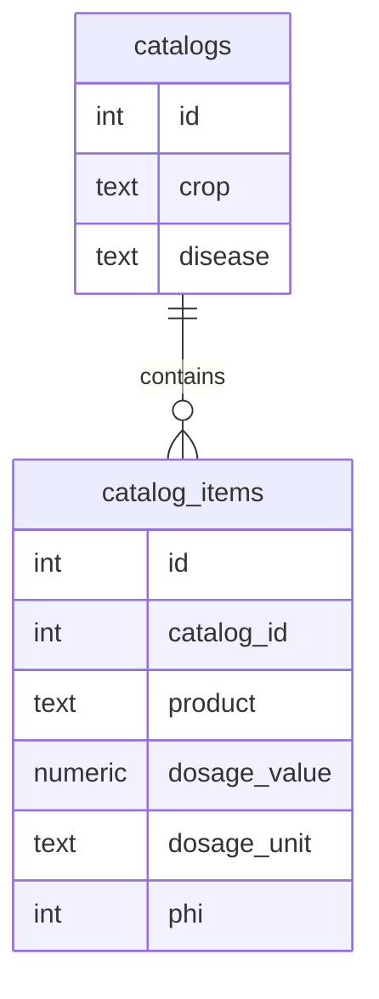

Data Contract – «Карманный агроном» (Bot‑Phase)

Version 1.23 — 9 April 2026 (v1.22 → v1.23: restart-safe bot session hardening)
API: v1.10.0

0 · Scope

Документ фиксирует схему БД, правила хранения, линии происхождения данных и JSON‑контракты API для MVP Telegram‑бота.

Мастер диагностики собирает медиагруппу 3–8 фото с подсказками «Как сфоткать» (общий вид, лист лицевая, лист изнанка, плод/цветок/корень опционально). Анализ запускается после базового минимума: общий + лицевая + изнанка листа; остальное предлагается дослать или пропустить. В API отправляется вся подборка (до 8 фото), чтобы модель делала единый комплексный разбор по всем кадрам; fallback на один кадр остаётся только для legacy-сценариев. Подборка чистится по таймауту 30 мин. Для low-confidence (`confidence < 0.65`) бот автоматически открывает re-check сессию и требует минимум 2 уточняющих фото (макро симптома + изнанка листа), до завершения re-check не показывает пользователю CTA планирования обработки. Follow-up CTA «Дослать фото к этому разбору» доступен как в карточке диагноза, так и из экрана «Мои растения» для активного объекта: в течение 72 часов бот открывает специальную сессию, которая привязывает новые снимки к исходному `case_id`/`object_id` и пропускает повторный шаг same-plant. Если follow-up пришёл с валидным `case_id`, а `crop_hint` не передан, backend подставляет культуру из кейса как fallback-hint для GPT, чтобы удержать тему того же разбора. Если фото отправлено reply на бот-сообщение с валидным diagnosis-context (TTL 72ч), follow-up сессия активируется автоматически и фото не уходит в primary-checklist «минимум 3». Для restart-safe восстановления reply-контекста используется персистентная таблица `diagnosis_message_contexts` (`chat_id + message_id -> diagnosis_id`). Для indoor-объектов (`object.type=indoor`) при построении плана исключаются weather/rain-trigger стадии; при пустом результате добавляется безопасный indoor fallback-stage. Сообщение диагноза по умолчанию отправляется в кратком формате (вывод + 3 шага + 1 вопрос), а полный текст доступен через callback `diag_details|<diagnosis_id>`. Для живого ассистента доступен optional RAG-слой: чанки внешних источников хранятся в `knowledge_chunks`, retrieval выполняется через `pgvector` при включённом feature-flag.

Объекты хранят координаты в meta.lat/meta.lon (числа, диапазон lat −90..90, lon −180..180); частичные апдейты не затирают существующий meta. Координаты можно обновить через /location, geo-point или адрес (геокодер + кеш). После `/location` и callback `plan_location_geo|<object_id>` бот отдаёт быстрый reply-keyboard с `request_location`; после получения геопозиции клавиатура удаляется (`remove_keyboard`). Сессия `/location` хранится в Redis (`bot:location_session:<user_id>`) с TTL и grace-периодом на восстановление после рестарта/таймаута; входящий geo/address применяется только к `entry.objectId`, fallback на `last_object_id` запрещён.
Сорт и метка участка/ряда сохраняются в meta.variety и meta.note; бот просит уточнить их после создания объекта и показывает в чипах/«Мои планы». Prompt для `variety` / `note` / `rename` хранится в Redis (`bot:object_details_session:<user_id>`) и принимает ответ только как reply на конкретный `promptMessageId`; при mismatch возвращается `object_details_reply_required`, при протухшем prompt — `object_details_expired`.
Сессия `/support` хранится в Redis (`bot:support_session:<user_id>`) с TTL и grace-периодом; если пользователь отвечает на prompt после истечения/потери контекста, бот возвращает `support_expired` и не передаёт текст дальше в ассистента/FAQ.
Окно ожидания региона после FAQ/CTA «препараты по региону» хранится в Redis (`bot:region_prompt:<user_id>`) с TTL; после рестарта бот всё ещё принимает ответ как регион, а не отдаёт его в общий текстовый роутинг.
Pending-комментарий beta survey Q3 хранится в Redis (`bot:beta_survey_comment:<user_id>`) с TTL и grace-периодом; при наличии активного region-prompt или явного регионального интента комментарий опроса не должен перехватывать сообщение.
Сессия живого ассистента хранится в Redis (`bot:assistant_session:<user_id>`) с TTL и grace-периодом; восстанавливаются `history`, `pendingMessage`, `pendingTopic`, `pendingProposalId`, `objectId`, чтобы после рестарта follow-up и подтверждение смены контекста продолжали тот же диалог без потери состояния.

При автодетекте локации бот показывает карточку «Нашли участок возле…?» с кнопкой карты (OSM) и подтверждением/изменением. Автопросы не спамят: TTL 12 ч на подтверждение, повторный запрос не чаще 30 мин. Геокодер кешируется в Redis, ограничивается per-user rate‑limit и логирует таймауты/ошибки.

1 · Storage & Retention

Фото хранятся в S3 (photos/) с TTL = 90 дней (lifecycle rule).

ML‑датасет (ml-dataset/) — копия снимков status=ok > 90 дн при Opt‑In пользователя, TTL = 2 года.

Табличные строки photos остаются ещё 30 дней после TTL с флагом deleted=true.

Платёжные данные храним 5 лет (ФЗ‑402).

Журнал смен Runs живёт в Google Sheets (`Runs!A:H`). Хранение бессрочное на период пилота; ежедневный snapshot выгружается в S3/backup. Доступ к листу ограничен сервисным аккаунтом и менеджерами магазинов, правки фиксируются в audit log Google Drive.

2 · Logical Schema (ER‑text)

users 1—n photos
users 1—n payments
users 1—n partner_orders
users 1—n analytics_events
photos 1—1 protocols
catalogs 1—n catalog_items
shops (external) 1—1 runs(run_date) — executor привязан по Telegram tg_id (username опционален)

```mermaid
erDiagram
    catalogs ||--o{ catalog_items : contains
    catalogs {
        int id
        text crop
        text disease
    }
    catalog_items {
        int id
        int catalog_id
        text product
        numeric dosage_value
        text dosage_unit
        int phi
    }
```

3 · Table Definitions

3.1 users

Column

Type

Notes

id

SERIAL PK

tg_id

BIGINT UNIQUE NOT NULL

api_key

VARCHAR(64) UNIQUE

per-user API key for internal requests; `ensureUser()` в боте всегда генерирует ключ при первом апсерте и дополняет legacy-строки с `NULL` (data migration `20260211_backfill_user_api_keys`)

pro_expires_at

TIMESTAMP

autopay_enabled

BOOLEAN DEFAULT FALSE

autopay_rebill_id

VARCHAR NULL

Tinkoff RebillId для автосписаний

opt_in

BOOLEAN DEFAULT FALSE

is_beta

BOOLEAN DEFAULT FALSE

beta_onboarded_at

TIMESTAMP NULL

beta_survey_completed_at

TIMESTAMP NULL

trial_ends_at

TIMESTAMP NULL

Marketing v2.4: конец 24ч пробного периода

utm_source

VARCHAR(50) NULL

Marketing: источник трафика

utm_medium

VARCHAR(50) NULL

Marketing: канал

utm_campaign

VARCHAR(100) NULL

Marketing: кампания

created_at

TIMESTAMP DEFAULT now()

3.2 photos

Column

Type

Notes

id

SERIAL PK

user_id

BIGINT (tg_id)

file_id

TEXT

file_unique_id

TEXT

width

INT

height

INT

file_size

INT

crop

TEXT

disease

TEXT

confidence

NUMERIC(4,3)

retry_attempts

INT DEFAULT 0

status

photo_status

error_code

error_code

NULLABLE

ts

TIMESTAMP DEFAULT now()

deleted

BOOLEAN DEFAULT FALSE

3.3 protocols  — unchanged

3.4 payments

Column

Type

Notes

id

SERIAL PK

user_id

INT FK → users(id)

amount

INT

копейки

currency

TEXT

RUB

status

payment_status

provider

TEXT

SBP:Tinkoff

external_id

TEXT

invoice/charge id

idempotency_key

TEXT

idempotency key for /payments/create

payment_url

TEXT

payment link returned by provider

sbp_url

TEXT

SBP QR link (optional)

provider_payment_id

TEXT

payment id in provider (Tinkoff PaymentId)

autopay

BOOLEAN DEFAULT FALSE

autopay_binding_id

TEXT

binding identifier

autopay_cycle_key

TEXT

YYYYMMDD (дата продления)

autopay_attempt

INT

номер попытки автосписания

autopay_next_retry_at

TIMESTAMP

когда запускать следующую попытку

prolong_months

INT

created_at

TIMESTAMP DEFAULT now()

updated_at

TIMESTAMP

3.5 partner_orders

Column

Type

Notes

id

SERIAL PK

user_id

BIGINT (tg_id)

order_id

TEXT

внеш. id AgroStore

protocol_id

INT FK → protocols(id)

price_kopeks

INT

signature

TEXT

HMAC партнёра

status

order_status

created_at

TIMESTAMP DEFAULT now()

3.6 photo_usage (legacy)

Column

Type

PK

user_id

BIGINT

✓

month

CHAR(7)

YYYY‑MM, ✓

used

INT

updated_at

TIMESTAMP

3.6.1 case_usage (Marketing Plan v2.4)

Заменяет photo_usage для подсчёта кейсов (неделя вместо месяца).

Column

Type

PK

Notes

user_id

BIGINT

✓

FK → users.id

week

CHAR(8)

✓

YYYY‑Www (ISO week)

cases_used

INT

Кол-во использованных кейсов за неделю

last_case_id

BIGINT

FK → cases.id, последний кейс

updated_at

TIMESTAMP

Бизнес-логика:
- Free: 1 кейс/неделю, сброс в понедельник
- Pro (199₽/мес): безлимит
- Trial (24ч): безлимит
- Low confidence (<0.6): кейс не списывается
- Повторная проверка того же растения в течение 10 дней не списывает кейс
- Проверка «это то же растение?» берёт последний кейс в окне 10 дней с фильтром по активному `users.last_object_id` (если выбран объект)

3.6.2 paywall_reminders

Хранит напоминания о доступности нового бесплатного разбора.

Column

Type

PK

Notes

user_id

BIGINT

✓

FK → users.id

fire_at

TIMESTAMP

Когда отправлять

created_at

TIMESTAMP

По умолчанию now()

updated_at

TIMESTAMP

Обновление при повторном запросе

sent_at

TIMESTAMP

NULL, если не отправлено

3.7 analytics_events

Column

Type

Notes

id

SERIAL PK

user_id

BIGINT

event

TEXT

e.g. payment_success, autopay_fail

utm_source

TEXT

utm_medium

TEXT

utm_campaign

TEXT

ts

TIMESTAMP DEFAULT now()

3.8 catalogs

Column

Type

Notes

id

SERIAL PK

crop

TEXT

disease

TEXT

3.9 catalog_items

Column

Type

Notes

id

SERIAL PK

catalog_id

INT FK → catalogs(id)

product

TEXT

dosage_value

NUMERIC

dosage_unit

TEXT

phi

INT

3.10 runs_sheet (Google Sheets)

Column

Type

Notes

run_date

DATE

Календарная дата; часть PK

shop_id

TEXT

Уникальный идентификатор магазина; часть PK

shop_name

TEXT

Человекочитаемое название

manager_handle

TEXT

Telegram менеджера

status

shift_status

waiting/in_progress/done

executor_username

TEXT

Опционально, если есть username

executor_tg_id

BIGINT

Required, fallback на случай отсутствия username

started_at

TIMESTAMP

Когда первый сотрудник нажал «Начать смену»

updated_at

TIMESTAMP

Последнее изменение строки Runs

updated_by

TEXT

`bot` или `@manager`, кто внёс правку/сброс

checklist_state

TEXT

`open` / `done`; синхронизируется при закрытии чек-листа

3.11 diagnosis_feedback

Column

Type

Notes

id

SERIAL PK

user_id

BIGINT → users.id

case_id

BIGINT → cases.id

q1_confidence_score

INT (1–5)

q2_clarity_score

INT (1–4), NULL пока опрос не завершён

q3_comment

TEXT NULL

created_at

TIMESTAMP DEFAULT now()

updated_at

TIMESTAMP DEFAULT now()

Поведение: текст Q3 принимается только в коротком окне после Q2 (TTL `BETA_SURVEY_COMMENT_TTL_MS`, default 10 минут). Если сообщение пользователя похоже на операционный запрос (например, «регион/препарат/чем обработать»), оно не должно сохраняться как `q3_comment` и передаётся в основной диалоговый обработчик.
После CTA «Спросить про препараты» бот хранит in-memory состояние ожидания региона (`FAQ_REGION_PROMPT_TTL_MS`, default 15 минут), чтобы короткий ответ вроде «Москва» не терялся и не перехватывался beta-опросом.
После получения региона бот возвращает не только подтверждение региона, но и краткий `regional_products`-ответ по текущему диагнозу (если он есть в контексте), плюс CTA на ассистента.

3.12 followup_feedback

Column

Type

Notes

id

SERIAL PK

user_id

BIGINT → users.id

case_id

BIGINT → cases.id

due_at

TIMESTAMP NULL

retry_at

TIMESTAMP NULL

sent_at

TIMESTAMP NULL

answered_at

TIMESTAMP NULL

attempts

INT DEFAULT 0

status

TEXT (pending/waiting_result/answered/blocked)

action_choice

TEXT (none/bot_plan/own_way/human_expert)

result_choice

TEXT (better/same/worse) NULL

created_at

TIMESTAMP DEFAULT now()

updated_at

TIMESTAMP DEFAULT now()

3.13 beta_events

Column

Type

Notes

id

SERIAL PK

user_id

BIGINT → users.id

event_type

TEXT (beta_entered/beta_photo_sent/beta_first_diagnosis/beta_survey_completed/beta_followup_answered/qa_case_logged)

payload

JSON

`qa_case_logged` payload (bot QA intake):
- `case_id`: string (`QA-YYYYMMDD-...`)
- `tester_tg_id`: int
- `tester_username`: string|null
- `tester_name`: string|null
- `chat_id`: int
- `chat_type`: string
- `message_id`: int|null
- `reply_to_message_id`: int|null
- `message_link`: string|null
- `created_at_msk`: string (`DD.MM.YYYY HH:MM:SS`)
- `source`: string (`command`/`wizard`/`hashtag`/`photo_caption`/...)
- `plant`: string|null
- `scenario`: enum (`new_diagnosis`/`followup_photo`/`ask_products`/`assistant_chat`/`pending_retry`)
- `severity`: enum (`S1`/`S2`/`S3`)
- `error_type`: enum (`none`/`wrong_class`/`wrong_risk`/`wrong_action`/`context_lost`/`ux_dead_end`/`hallucination`/`other`)
- `confidence`: string|null (например `58%`)
- `expected`: string|null
- `actual`: string|null
- `notes`: string|null
- `raw_text`: string|null
- `files`: array<{type,file_id,file_unique_id}>
- `diagnosis_id`: int|null
- `diagnosis_link_mode`: enum (`explicit`/`latest_recent`/`none`)
- `diagnosis_link_confidence`: enum (`high`/`medium`/`none`)

Wizard-step contract: при `qa_add:*` бот принимает значение поля только как reply на конкретный prompt-message-id (`awaitingReplyToMessageId`). Любой другой reply/текст возвращает `qa_intake_reply_required`, шаг остаётся активным, и в аналитику пишется событие `qa_intake_reply_mismatch`.

created_at

TIMESTAMP DEFAULT now()

3.14 knowledge_chunks

Column

Type

Notes

id

BIGSERIAL PK

source_url

TEXT NOT NULL

title

TEXT NULL

category

VARCHAR(64) NULL

priority

VARCHAR(8) NULL

lang

VARCHAR(8) NOT NULL DEFAULT 'en'

chunk_text

TEXT NOT NULL

chunk_hash

VARCHAR(64) UNIQUE NOT NULL

meta_json

JSONB NOT NULL DEFAULT `{}`

embedding

vector(1536) NULL (`pgvector`, cosine distance)

created_at

TIMESTAMPTZ DEFAULT now()

updated_at

TIMESTAMPTZ DEFAULT now()

Indexes:
- `ix_knowledge_chunks_source_url (source_url)`
- `ix_knowledge_chunks_category_priority (category, priority)`
- `ix_knowledge_chunks_embedding_ivfflat` (`ivfflat`, `vector_cosine_ops`, lists=100)

RAG infra contract:
- Поддерживаемая БД: только PostgreSQL 15+ с установленным `pgvector` (`vector` extension).
- Проверка окружения перед загрузкой корпуса: `python scripts/rag_preflight.py`.
- Smoke retrieval после загрузки: `python scripts/rag_smoke_check.py --min-hits 1`.

RAG env contract:
- `ASSISTANT_RAG_ENABLED` (default `0`)
- `ASSISTANT_RAG_TOP_K` (default `4`)
- `ASSISTANT_RAG_MIN_SIMILARITY` (default `0.2`)
- `ASSISTANT_RAG_IVFFLAT_PROBES` (default `50`)
- `OPENAI_RAG_EMBEDDING_MODEL` (default `text-embedding-3-small`)
- Optional: `ASSISTANT_RAG_FILTER_LANG`, `ASSISTANT_RAG_FILTER_CATEGORY`, `ASSISTANT_RAG_MAX_CHUNKS_PER_SOURCE` (default `2`)

4 · Enum Definitions

CREATE TYPE payment_status AS ENUM ('success','fail','cancel','bank_error');
CREATE TYPE photo_status   AS ENUM ('pending','ok','retrying','failed');
CREATE TYPE order_status   AS ENUM ('new','processed','cancelled');
CREATE TYPE error_code     AS ENUM ('NO_LEAF','LIMIT_EXCEEDED','GPT_TIMEOUT','BAD_REQUEST','UNAUTHORIZED','UPGRADE_REQUIRED','TOO_MANY_REQUESTS','SERVICE_UNAVAILABLE','FORBIDDEN');
CREATE TYPE shift_status   AS ENUM ('waiting','in_progress','done');

5 · Data Lifecycle

graph TD
  PENDING[photos.status=pending] -->|predict| OK[status=ok]
  PENDING -->|retry| RETRY[status=retrying]
  RETRY -->|fail| FAILED[status=failed]
  RETRY -->|predict| OK

Retry worker: сервис `retry_diagnosis` циклично обрабатывает `pending/retrying` через GPT и обновляет `photos.status`, `retry_attempts`, `confidence`, `roi`.

S3: auto‑delete спустя 90 дней.

DB: deleted=true → 30 дней → hard delete.

ML‑dataset: Opt‑In → TTL 2 года.

Quota (photo_usage) ресет 1‑го числа месяца (cron).

Runs (Google Sheets): одна строка на магазин и дату. `status` меняется на `done` после чек-листа или на `waiting` после `/reset`. История правок доступна через audit log Google Drive.

6 · API ↔ DB Mapping

Endpoint

Action

POST /v1/ai/diagnose

INSERT → photos, UPDATE photo_usage.used

GET  /v1/limits

SELECT photo_usage + count photos

GET  /v1/users/{id}/export

SELECT photos/payments/analytics_events (streamed ZIP)

GET  /v1/users/{id}/consents

SELECT user_consents

POST /v1/users/{id}/consents/accept

INSERT consent_events + UPSERT user_consents

POST /v1/users/{id}/consents/revoke

INSERT consent_events + UPSERT user_consents

POST /v1/payments/sbp/webhook

INSERT → payments (invoice)

POST /v1/payments/sbp/autopay/webhook

INSERT → payments (autopay)

POST /v1/payments/sbp/autopay/cancel

UPDATE users.autopay_enabled=false

POST /v1/ask_expert

INSERT → analytics_events (ask_expert)

POST /v1/partner/orders

INSERT → partner_orders (signature)

6.1 · /v1/ai/diagnose

Принимает фото (multipart `image` для одного кадра, multipart `images[]` для подборки до 8 кадров, либо JSON `image_base64`). Возвращает {crop, disease, confidence, protocol_status, protocol{id, product, dosage_value, dosage_unit, phi, category, status, waiting_days}}; создаёт photos + инкрементирует photo_usage.used. Бот вызывает endpoint после сбора базового минимума (общий вид + лист лицевая + лист изнанка) в сессии до 8 фото; плод/цветок и корень опциональны. В основном сценарии бот отправляет все кадры подборки в один запрос, чтобы снизить ошибки на частичных/узких ракурсах. Для `confidence < 0.65` бот запускает автоматический re-check: создаёт follow-up сессию с `minPhotos=2` (макро + изнанка), сохраняет связь по `case_id/object_id` и просит пересъёмку до показа CTA планирования. Для follow-up режима (из карточки диагноза или кнопки в «Мои растения» для активного объекта) бот передаёт `case_id` из предыдущего разбора и сохраняет `object_id`, чтобы нить кейса не терялась. Сессия снимков очищается по таймауту 30 мин; лишние кадры >8 игнорируются.
При follow-up запросе с валидным `case_id` backend принимает этот кейс как источник контекста и, если `crop_hint` пустой, подставляет `cases.crop` как fallback-подсказку в GPT-запрос.

Дополнительно: ответ может содержать variety/variety_ru (сорт/культивар). Если бот смог привязать диагноз к существующему/новому объекту по культуре, поле object_id прокидывается в recent_diagnoses и далее используется /plan_treatment без ручного выбора старых объектов. Кнопка из карточки диагноза использует callback-data `plan_treatment|<diagnosis_id>` (новый формат); legacy `plan_treatment` сохранён для обратной совместимости.
Для качества распознавания культуры API также возвращает `crop_confidence` и `crop_candidates[]` (топ 2–3 кандидата). Если `crop_confidence` ниже `CROP_CLARIFY_THRESHOLD` (дефолт `0.75`), backend принудительно выставляет `need_clarify_crop=true` и формирует `clarify_crop_variants[]` даже при отсутствии этого флага в ответе модели.
Пост-обработка текстов диагноза в боте добавляет safety-triage по симптомам: для сценариев «пятна на листьях» — чеклист по паттерну пятен/риску ожога после опрыскивания/проверке прокусов; для сценариев вода/грунт — запрос фото грунта+дренажа и развилка на проверку корней при риске перелива. Короткие ответы пользователя (`мокро/сухо/влажно`, описание состава грунта) интерпретируются как диагностический follow-up и не должны уходить в общий fallback-ответ.
При `need_clarify_crop=true` бот оставляет только безопасные действия и не показывает жёсткие CTA планирования/препаратов до уточнения культуры.

6.2 · /v1/assistant/chat

`metadata` поддерживает:
- `recent_diagnosis_id` (опционально),
- `plan_session_id` (опционально),
- `history` (опционально): массив до 24 элементов вида `{ role: "user" | "assistant", text: string(1..1000) }`.

Бот хранит короткую сессионную историю и передаёт её в `metadata.history`; backend использует её только как conversational-контекст для LLM и не рассматривает как источник истины вместо `cases/plans/events`.

7 · Ownership & Lineage

Airflow DAG export_daily_metrics → S3 → Metabase.См. Data_Lineage.xlsx.

8 · Privacy & Compliance

Фото обезличены (EXIF удаляется).

TTL: 90 дн (S3) + 30 дн soft‑delete.

ML‑датасет — только при Opt‑In, TTL 2 года.

Платежи: storage 5 лет (ФЗ‑402).

DSR: POST /v1/dsr/delete_user — каскадное удаление по user_id ≤ 30 дн.

Consent audit:

consent_events: append‑only журнал (user_id, doc_type, doc_version, action, source, occurred_at, meta).

user_consents: текущее состояние согласий (PK: user_id + doc_type, status, doc_version, source, updated_at).

meta (consent_events): tg_chat_id, message_id, callback_data (для бот‑согласий).

9 · Change Management

Схема версионируется через Alembic (semver).

Breaking → bump minor.

CI: openapi-diff + PR review Data Owner.

10 · Sign-off

Role

Name

Date

Tech Lead

—

☐

Data Owner

—

☐

QA

—

☐
